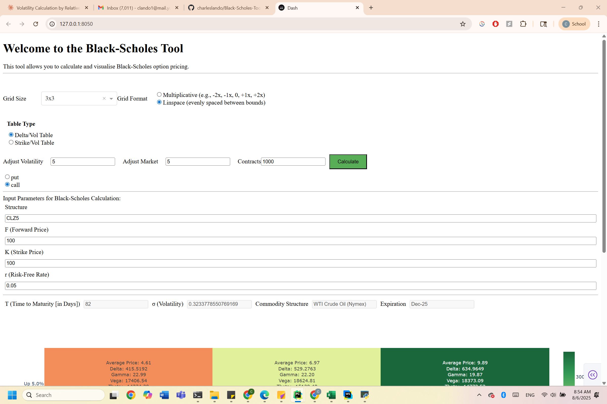
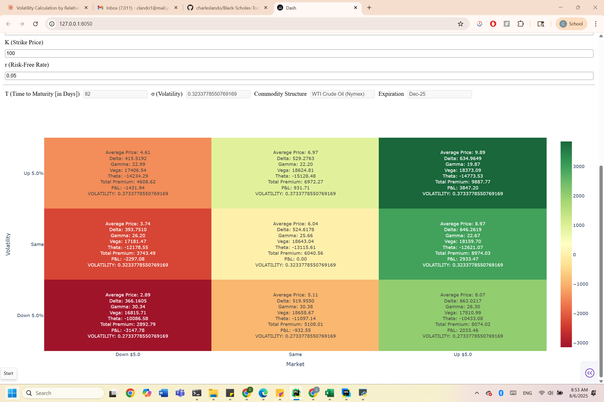

# https://black-scholes-tool-c82f806533d0.herokuapp.com/
# Black-Scholes Interactive Heatmap Tool

An interactive Dash web app to calculate and visualize Black-Scholes option prices and Greeks across varying market and volatility scenarios.  
Supports two volatility lookup modes—Delta/Vol interpolation and Strike/Vol interpolation—powered by custom solvers and your own volatility matrices.

---

## 🚀 Features

- **Delta/Vol Table**  
  Interpolate implied vol from a Delta–Volatility matrix to price options at any underlying‐volatility combination.

- **Strike/Vol Table**  
  Interpolate implied vol from a Strike–Volatility matrix based on moneyness (strike vs. forward).

- **Custom Grid**  
  Choose grid sizes (3×3, 5×5, 7×7, 9×9) and formats (multiplicative or linspace) for market & vol shifts.

- **Heatmap Visualization**  
  P&L heatmap of total portfolio P&L across scenarios, with hover text showing price, Greeks, premium, P&L, and applied vol.

- **Commodity Parsing**  
  Automatically parse commodity structure codes (e.g. `CLZ5`) to extract expiration, days-to-maturity, and lookup in your vol matrices.

---

